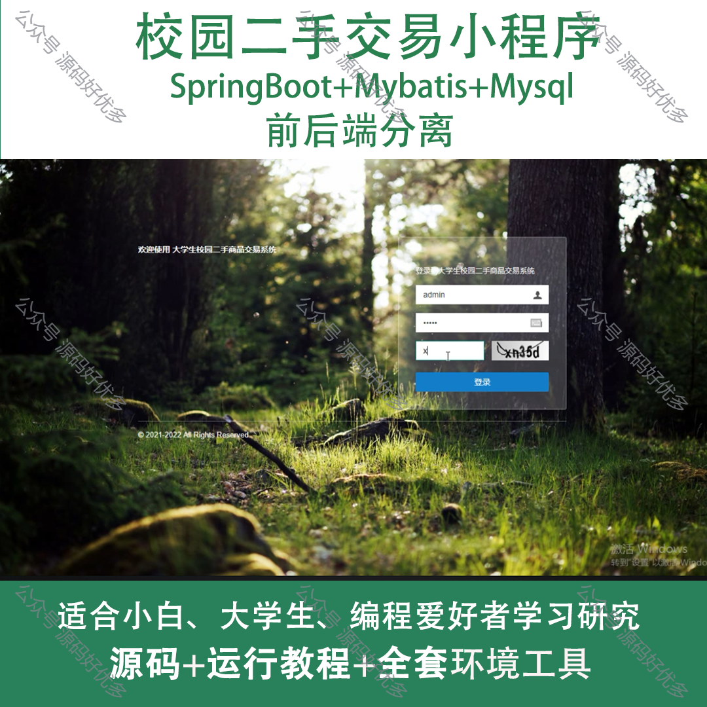
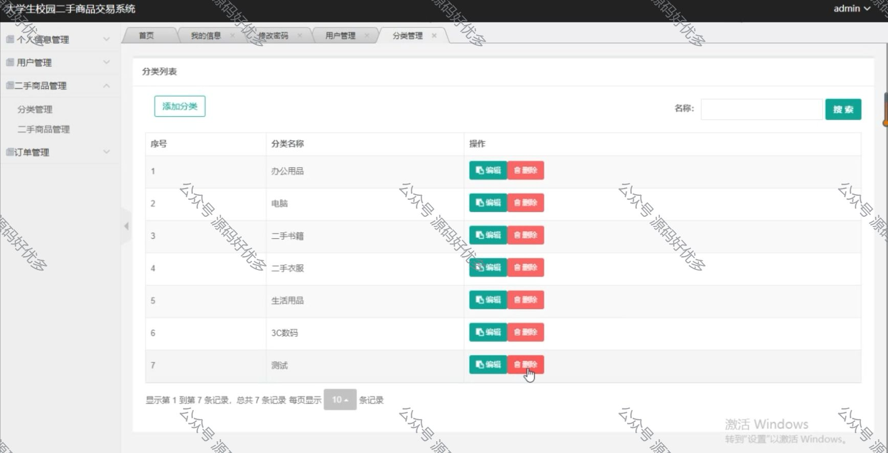
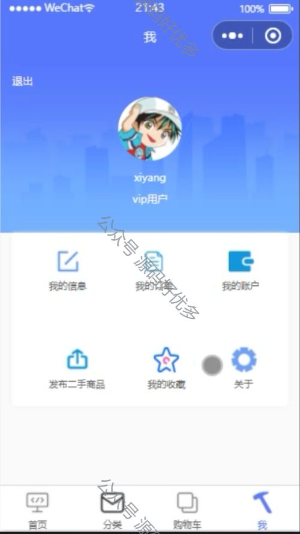
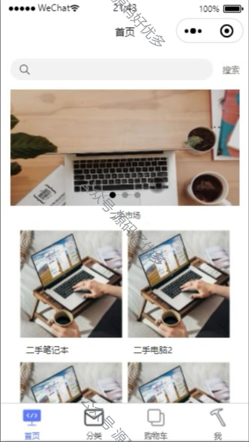
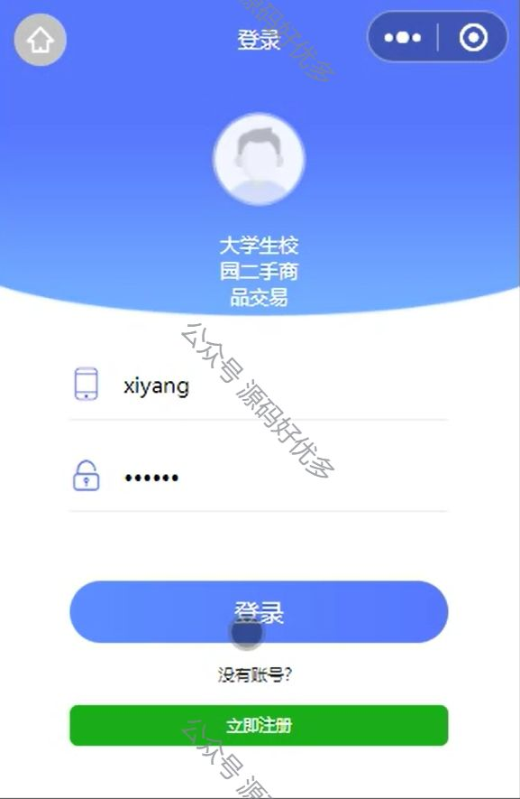
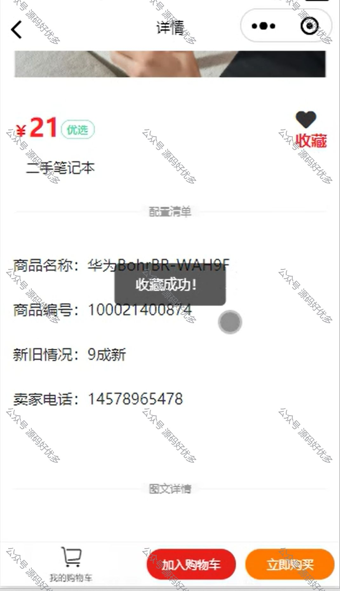
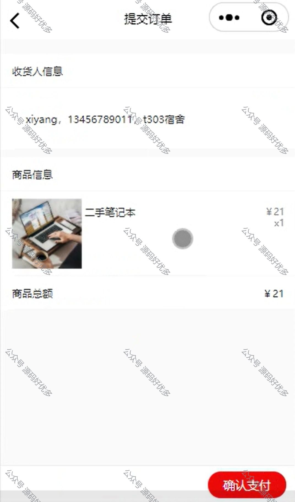
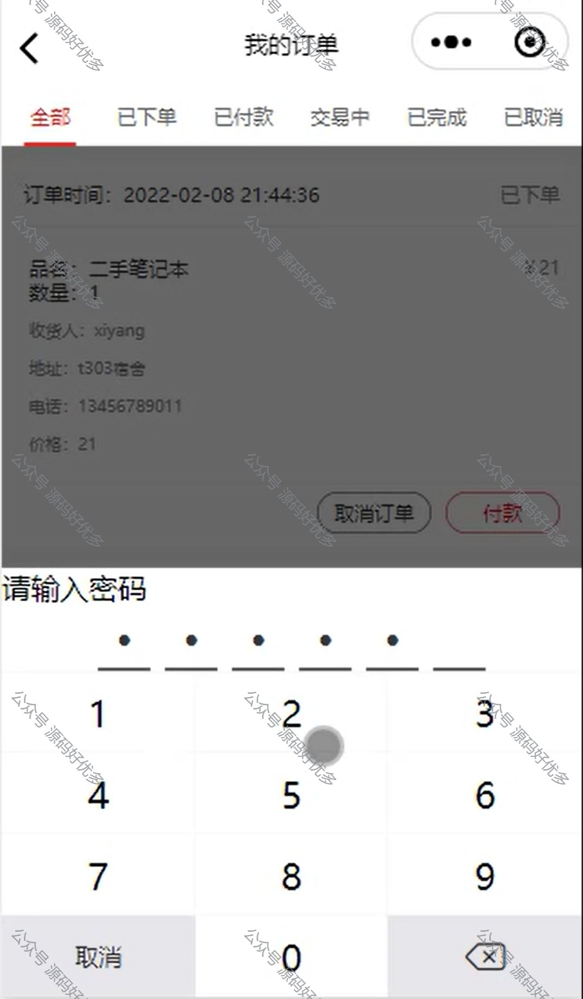
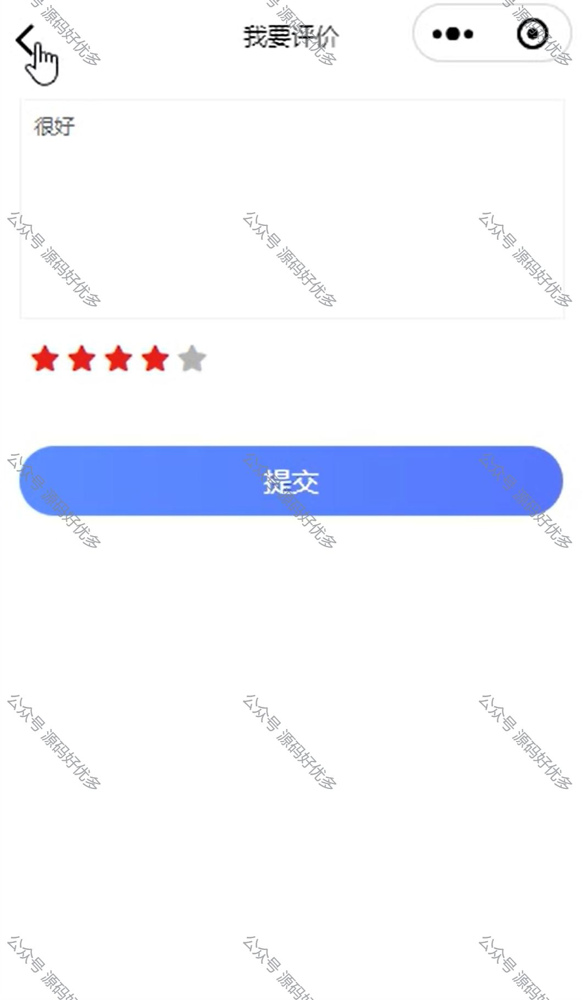
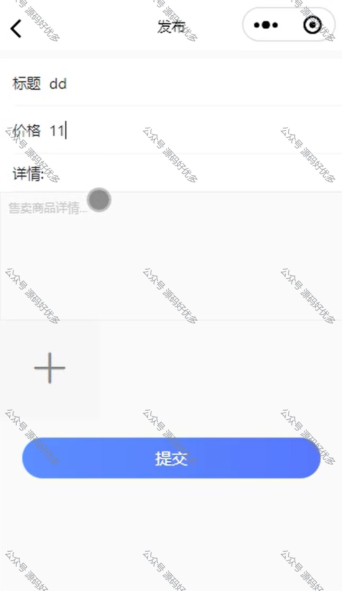

 
## 查看主页获取源码

> **作者介绍**： **✌**全网粉丝10W+本平台特邀作者、博客专家、CSDN新星计划导师、java领域优质创作者,博客之星、掘金/华为云/阿里云/InfoQ等平台优质作者、专注于项目实战 **✌**

  

### 一、作品包含

源码+数据库+全套环境和工具资源+部署教程

### 二、项目技术

前端技术：Html、Css、Js

数据库：MySQL

后端技术：Java、Spring Boot、MyBatis

  

### 三、运行环境

开发工具：IDEA,微信开发者工具

数据库：MySQL5.7

数据库管理工具：Navicat10以上版本

环境配置软件： JDK1.8+Maven3.6.3

### 四、项目介绍
项目编号：mpweixinA002

校园二手交易小程序，专为校园内的学生群体打造，提供了一个便捷、安全的交易平台。在这里，同学们可以轻松发布闲置物品，发现他人的优质二手资源，实现资源的有效循环利用。我们倡导绿色消费理念，旨在通过这个平台促进校园内的环保意识，同时帮助同学们节省开支，体验互帮互助的校园生活。

微信小程序用户端功能：

首页：展示推荐的闲置物品，用户可以浏览物品信息。
搜索：用户可以通过关键字搜索需要的闲置物品。
分类：用户可以选择查看需要的分类闲置物品。
选择商品：用户可以查看闲置物品的详细信息，并选择购买。
下单购买：用户可以将选中的物品添加至购物车，并进行下单购买。
评价：用户可以评价购买的闲置物品。
发布：用户可以发布闲置信息进行审核。
登录：用户可以使用账号进行登录，以便进行购买和管理。
注册：新用户可以通过填写个人信息进行注册。

后台管理员端功能：

用户管理：管理员可以查看和管理系统中的用户信息。
二手物品管理：管理员可以审核发布的闲置物品，并进行上架或下架操作。
举报管理：管理员可以处理用户发起的举报，进行相应的处理。
订单管理：管理员可以查看系统中的订单信息，包括已付款、待发货和已完成的订单。
管理员管理：超级管理员可以管理系统中的管理员账号，包括添加、修改和删除账号。

### 五、运行截图

  
